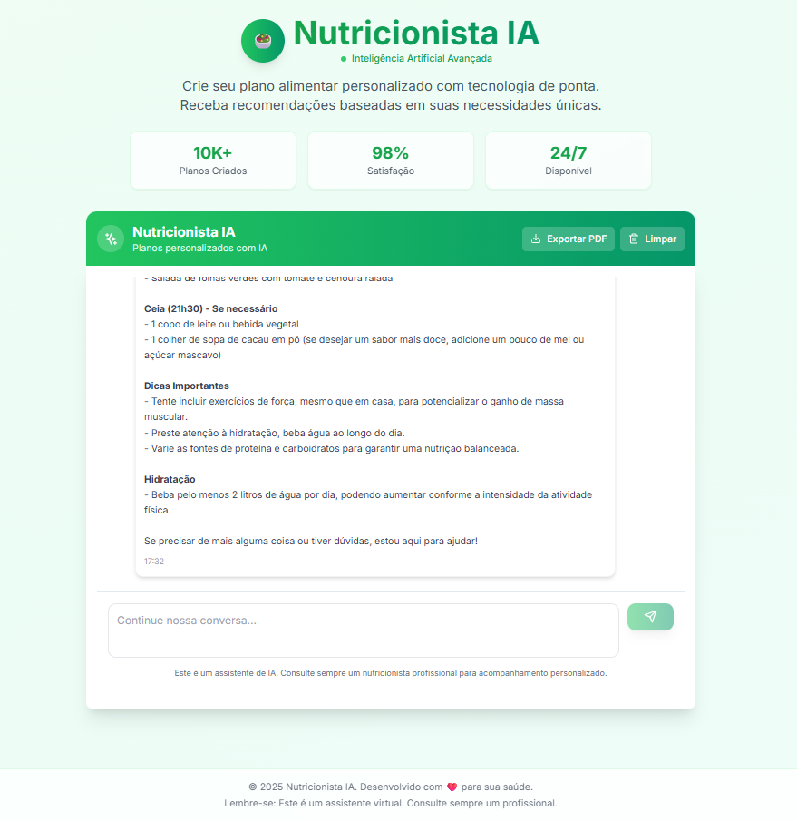
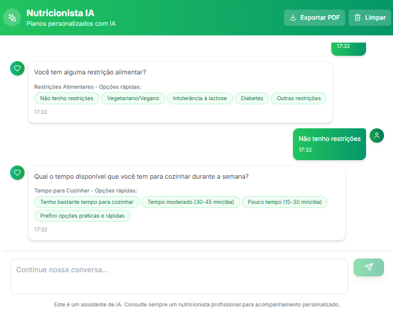

# 🥗 Nutricionista IA

Uma aplicação de inteligência artificial para criação de planos alimentares personalizados usando Next.js e OpenAI.

## 📱 Screenshots

### Tela Principal - Chat com IA



### Sistema de Perguntas Estruturadas


## ✨ Funcionalidades

- 🤖 **Chat com IA especializada** em nutrição usando GPT-4o-mini
- 📋 **Perguntas estruturadas** - uma por vez, sem repetições
- 🎯 **Botões de resposta rápida** para atividade física, objetivos, restrições e tempo
- 📄 **Exportação para PDF** profissional com layout limpo e organizado
- 🎨 **Interface moderna** com gradientes e animações
- 🔒 **Segurança** com API keys protegidas no servidor
- 🚫 **Sistema anti-repetição** - nunca pergunta a mesma informação duas vezes
- ⚡ **Geração inteligente** - cria planos com informações mínimas
- 📱 **Totalmente responsivo** - funciona em desktop e mobile
- 📋 **Status visual** - feedback de sucesso/erro na exportação

## 🚀 Como usar

1. **Inicie uma conversa**: O assistente perguntará seu nome e idade
2. **Responda progressivamente**: Use botões rápidos ou digite respostas personalizadas
3. **Informações coletadas**: Nome, idade, peso, altura, atividade física, objetivo
4. **Receba seu plano**: Plano alimentar completo com horários e quantidades
5. **Exporte em PDF**: Documento profissional com seu nome e plano personalizado

## 🚀 Tecnologias Utilizadas

- **Next.js 14** - Framework React com App Router
- **TypeScript** - Tipagem estática
- **LangChain** - Framework para aplicações com LLM
- **OpenAI GPT-4o-mini** - Modelo de linguagem
- **Tailwind CSS** - Estilização
- **Shadcn/ui** - Componentes de interface
- **jsPDF** - Geração de PDFs
- **html2canvas** - Captura de elementos HTML
- **Lucide React** - Ícones modernos

## 📋 Funcionalidades

### Agente de Nutrição Inteligente
- Conversa natural e contextual
- Coleta informações do usuário através de perguntas específicas
- Adapta-se ao perfil e necessidades de cada usuário
- Gera planos alimentares personalizados

### Informações Coletadas
- **Dados básicos**: idade, gênero, peso, altura
- **Atividade física**: nível de atividade
- **Restrições**: alergias, intolerâncias, dietas especiais
- **Saúde**: condições médicas relevantes
- **Objetivos**: perda de peso, ganho de massa, etc.
- **Preferências**: alimentos favoritos, horários, etc.

### Planos Personalizados
- Cálculo de necessidades calóricas
- Distribuição de macronutrientes
- Refeições detalhadas com horários
- Sugestões de hidratação
- Dicas personalizadas
- Orientações de acompanhamento

## 🛠️ Instalação e Configuração

### Pré-requisitos
- Node.js 18+
- npm, yarn ou pnpm
- Conta OpenAI com API key

### Passo a passo

1. **Clone o repositório**
```bash
git clone <url-do-repositorio>
cd Nutricionista-IA
```

2. **Instale as dependências**
```bash
npm install
# ou
yarn install
# ou
pnpm install
```

3. **Configure as variáveis de ambiente**
```bash
cp .env.example .env.local
```

Edite o arquivo `.env.local` e adicione sua API key do OpenAI:
```env
OPENAI_API_KEY=sk-your-openai-api-key-here
```

4. **Execute o projeto**
```bash
npm run dev
# ou
yarn dev
# ou
pnpm dev
```

5. **Acesse a aplicação**
Abra [http://localhost:3000](http://localhost:3000) no seu navegador.

## 🏗️ Estrutura do Projeto

```
src/
├── app/                    # App Router (Next.js 14)
│   ├── api/               # API Routes
│   │   └── chat/          # Endpoint do chat
│   ├── globals.css        # Estilos globais
│   ├── layout.tsx         # Layout principal
│   └── page.tsx           # Página inicial
├── components/
│   ├── ui/                # Componentes base (Shadcn/ui)
│   │   ├── button.tsx
│   │   ├── card.tsx
│   │   ├── input.tsx
│   │   └── scroll-area.tsx
│   ├── ChatInterface.tsx  # Interface principal do chat
│   └── PDFExportButton.tsx # Botão de exportação PDF
├── lib/
│   ├── agents/
│   │   └── nutrition-agent.ts  # Agente de nutrição com anti-repetição
│   ├── utils/
│   │   └── pdf-export.ts      # Geração de PDFs
│   └── utils.ts           # Utilitários gerais
└── types/
    └── index.ts           # Tipos TypeScript
```

## 🤖 Como Funciona o Agente

### Fluxo de Conversa
1. **Boas-vindas**: O agente se apresenta e pergunta como pode ajudar
2. **Coleta de informações**: Faz perguntas específicas sobre o usuário
3. **Análise do perfil**: Processa as informações coletadas
4. **Geração do plano**: Cria um plano alimentar personalizado
5. **Orientações**: Fornece dicas e sugestões de acompanhamento

### Exemplo de Interação
```
Usuário: "Olá, quero um plano alimentar"

Agente: "Olá! Sou seu nutricionista virtual e vou te ajudar a criar 
um plano alimentar personalizado. Para começar, qual é o seu nome?"

Usuário: "Meu nome é Maria"

Agente: "Prazer, Maria! Agora me conte, quantos anos você tem?"

Usuário: "Tenho 28 anos"

Agente: "Perfeito! Qual é o seu peso atual?"

[Sistema nunca repete perguntas já feitas]
[Botões rápidos aparecem para atividade física e objetivos]
[Gera plano quando tem informações mínimas]
```

## 🎯 Personalizações Possíveis

### Adicionando Novos Prompts
Edite o arquivo `src/lib/agents/nutrition-agent.ts` para modificar o comportamento do agente.

### Integrando com Banco de Dados
Adicione persistência de dados implementando:
- Prisma ou outro ORM
- Armazenamento de conversas
- Histórico de planos

### Melhorando a Interface
- Adicione componentes de visualização de planos
- Implemente exportação para PDF
- Adicione sistema de avaliação

## 📊 Estrutura dos Dados

### UserProfile
```typescript
interface UserProfile {
  age?: number;
  gender?: 'masculino' | 'feminino' | 'outro';
  weight?: number;
  height?: number;
  activityLevel?: 'sedentario' | 'leve' | 'moderado' | 'intenso';
  dietaryRestrictions?: string[];
  healthConditions?: string[];
  goals?: string[];
  preferences?: string[];
}
```

### Message
```typescript
interface Message {
  id: string;
  content: string;
  role: 'user' | 'assistant';
  timestamp: Date;
}
```

## 🔐 Segurança

- API keys são mantidas no servidor
- Validação de entrada com Zod
- Sanitização de dados do usuário
- Rate limiting recomendado para produção

## 🚀 Deploy

### Vercel (Recomendado)
```bash
npm install -g vercel
vercel --prod
```

### Outras Plataformas
- Netlify
- Railway
- Render

## 🤝 Contribuindo

1. Fork o projeto
2. Crie uma branch para sua feature
3. Commit suas mudanças
4. Push para a branch
5. Abra um Pull Request

## 📝 Licença

Este projeto está sob a licença MIT. Veja o arquivo `LICENSE` para mais detalhes.

## 📞 Suporte

Se você tiver dúvidas ou precisar de ajuda:
- Abra uma issue no GitHub
- Consulte a documentação do LangChain
- Verifique a documentação do OpenAI

---

**Desenvolvido com ❤️ usando Next.js, TypeScript e LangChain**